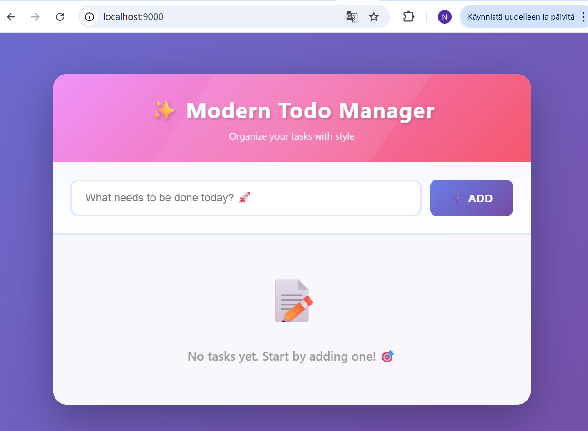
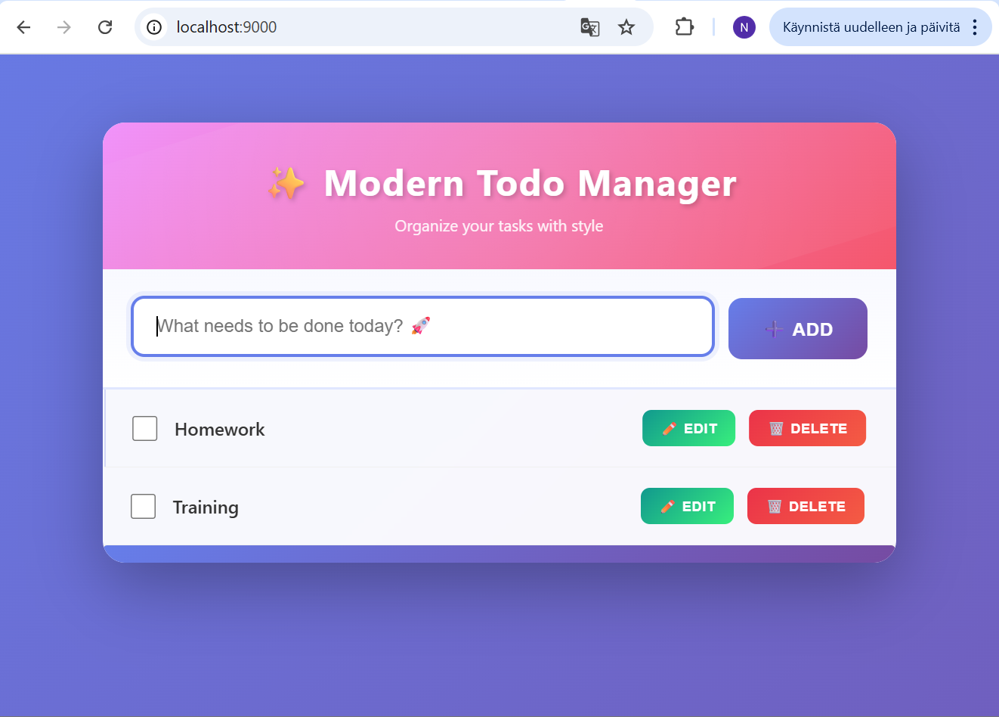
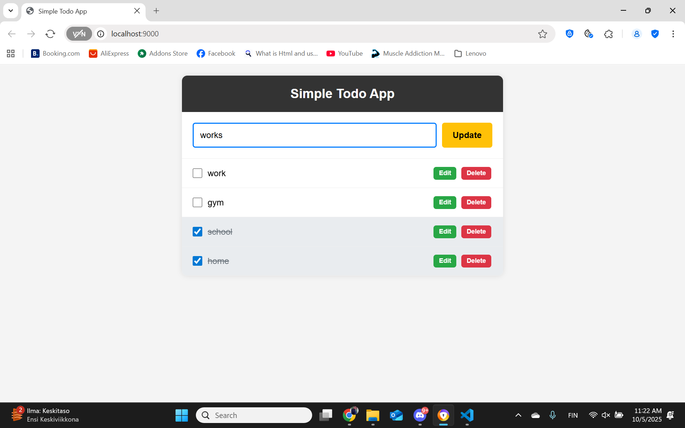
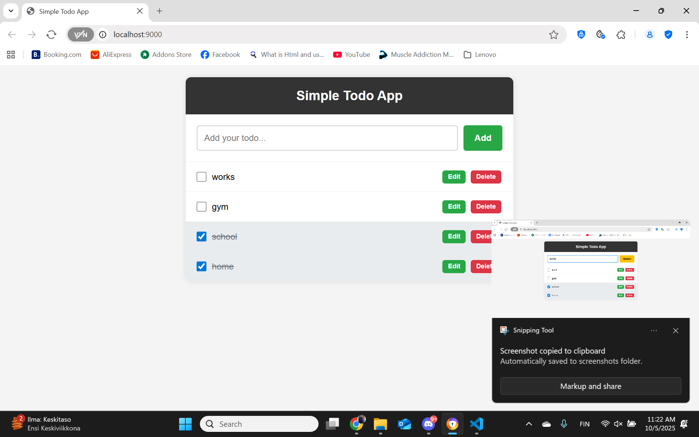
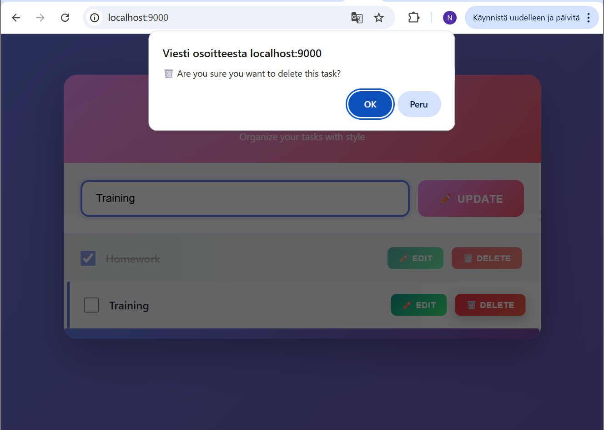
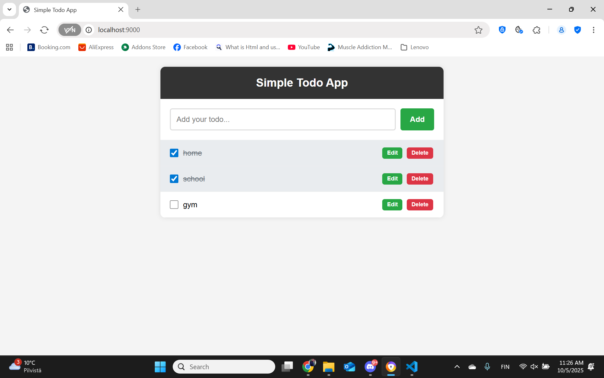
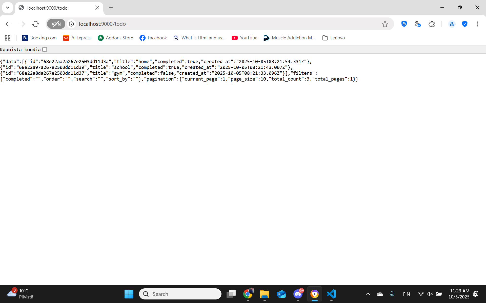
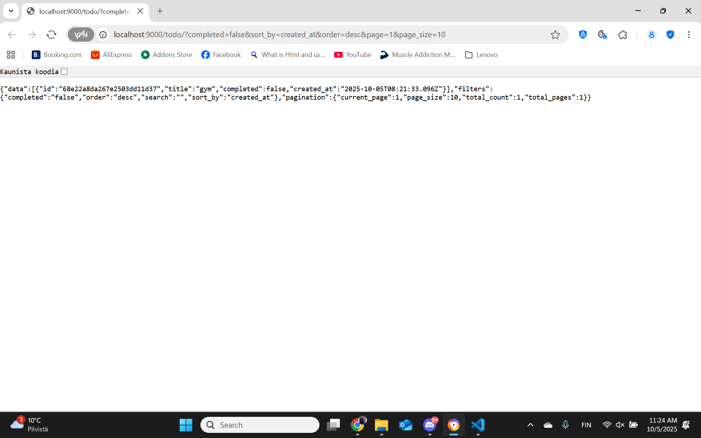
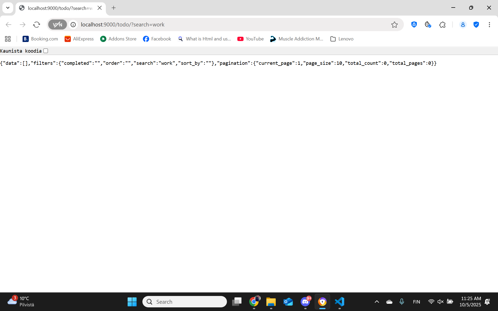

# ✨ Modern Todo Manager


A beautiful and efficient Todo application built with Go and MongoDB, featuring a modern gradient UI, RESTful API with **advanced filtering, sorting, and pagination** capabilities, and enhanced user experience with emojis and animations.

## 🎨 Recent UI/UX Modernization (December 2025)

This application has undergone a complete visual redesign to provide a modern, engaging user experience:

### Frontend Enhancements ([static/home.tpl](static/home.tpl))

- ✨ **Modern Gradient Design**: Purple-to-violet animated background gradient
- 🎨 **Gradient Buttons**: All buttons feature smooth gradient colors
- 💫 **Smooth Animations**:
  - Slide-in effect on page load
  - Fade-in animations for new todos
  - Hover effects with smooth transitions
  - Rotating background animation in header
  - Bounce animation for empty state
  - Shake animation for validation errors
- 🎯 **Enhanced Visual Elements**:
  - Larger, rounded containers with backdrop blur
  - Custom styled scrollbar with gradient
  - Box shadows and depth effects
  - Smooth hover states with transformations
- 😀 **Emoji Integration**: Strategic use of emojis throughout the UI (🚀, ✏️, 🗑️, 📝, 🎯)
- 🎪 **Improved Typography**: Modern font stack with better spacing and hierarchy
- 📱 **Better UX**: Larger touch targets, clearer visual feedback, improved empty states

### Backend Improvements

#### Enhanced API Messages ([handlers/todo.go](handlers/todo.go))

- ✅ **Success Messages**: Clear confirmation with emojis
  - `✅ Todo created successfully!`
  - `✅ Todo updated successfully!`
  - `🗑️ Todo deleted successfully!`
- ❌ **Error Messages**: More descriptive and user-friendly
  - `❌ Todo title cannot be empty!`
  - `❌ Invalid todo ID format`
  - `❌ Failed to update todo in database`

#### Improved Server Logging ([main.go](main.go))

- 🚀 **Startup Banner**: Eye-catching server start message
- 🔗 **Connection Info**: Clear MongoDB connection status
- ✅ **Success Indicators**: Database connection confirmation
- 🛑 **Graceful Shutdown**: Enhanced shutdown messages with emojis
- 👋 **Friendly Goodbye**: User-friendly exit message

#### Better Code Documentation ([models/todo.go](models/todo.go))

- 📝 Added clear comments explaining each struct's purpose
- 🏗️ Distinction between MongoDB models and API responses

### Color Scheme

- **Primary Gradient**: `#667eea` → `#764ba2` (Purple)
- **Secondary Gradient**: `#f093fb` → `#f5576c` (Pink)
- **Success Gradient**: `#11998e` → `#38ef7d` (Green)
- **Danger Gradient**: `#eb3349` → `#f45c43` (Red)
- **Background**: Animated purple gradient with 15s cycle

## 📍 Repository Information

**Local Project Path**: `c:\Users\Käyttäjä\Desktop\go-web-perust-2`

> **Note**: This is a local development project. It is not currently hosted in a public GitHub repository or deployed to any cloud platform. To share this code:
>
> 1. Initialize a Git repository: `git init`
> 2. Create a GitHub repository and push the code
> 3. Deploy to a cloud platform (Heroku, Railway, Render, etc.) for live testing

**API Access**: Currently running locally at `http://localhost:9000` when the application is started.

## Features

### Core Functionality

- ✅ Create, read, update, and delete todos (CRUD)
- 🔍 **Advanced Filtering** - Filter by completion status and search text
- 📊 **Sorting** - Sort by title, created_at, or completed status (asc/desc)
- 📄 **Pagination** - Page through results with metadata
- 🗄️ MongoDB integration for persistent storage
- 🌐 RESTful API endpoints
- 📱 Modern web interface with animated gradients
- ⚡ Fast and lightweight Go backend
- 🔧 Graceful server shutdown
- 🎯 Input validation with visual feedback

### UI/UX Features

- 🎨 Beautiful gradient design with animations
- 💫 Smooth transitions and hover effects
- 😀 Strategic emoji usage for better UX
- 📱 Responsive and modern interface
- ✨ Custom styled components
- 🎪 Professional typography and spacing

## Screenshots

### Web Interface


_Main todo application interface showing add/edit/delete functionality_


_Checking off completed todos_


_Editing todo items_


_Updated todo showing changes_


_Delete confirmation dialog_


_Final state after operations_

### API Responses


_Basic API response showing all todos with pagination metadata_

#### Advanced Filtering & Sorting


_API response with filtering: `?completed=false&sort_by=created_at&order=desc`_

#### Pagination


_API response with pagination: `?page=1&page_size=5`_


_Detailed pagination metadata showing current_page, page_size, total_count, and total_pages_

#### Search Functionality


_Search functionality: `?search=work` showing filtered results_

## Prerequisites

Before running this application, make sure you have:

- **Go 1.16+** installed
- **MongoDB** running on port 27017 (default)

## Installation

1. Clone or download the project:

   ```bash
   git clone <repository-url>
   cd go
   ```

2. Install dependencies:
   ```bash
   go mod download
   ```

## Running the Application

### Method 1: Run directly from source

```bash
go run main.go
```

### Method 2: Build and run executable

```bash
# Build the application
go build -o todo.exe main.go

# Run the executable
./todo.exe
```

The application will start on port **9000** by default.

## Configuration

### MongoDB Connection

By default, the application connects to MongoDB at `mongodb://localhost:27017`. You can override this by setting the `MONGO_URL` environment variable:

```bash
# Windows (PowerShell)
$env:MONGO_URL="mongodb://your-mongodb-url"

# Windows (Command Prompt)
set MONGO_URL=mongodb://your-mongodb-url

# Linux/MacOS
export MONGO_URL="mongodb://your-mongodb-url"
```

## API Endpoints

The application provides the following RESTful API endpoints:

| Method | Endpoint     | Description             |
| ------ | ------------ | ----------------------- |
| GET    | `/`          | Home page               |
| GET    | `/todo/`     | Get all todos           |
| POST   | `/todo/`     | Create a new todo       |
| PUT    | `/todo/{id}` | Update an existing todo |
| DELETE | `/todo/{id}` | Delete a todo           |

### API Examples

#### Create a Todo

```bash
curl -X POST http://localhost:9000/todo/ \
  -H "Content-Type: application/json" \
  -d '{"title": "Learn Go programming"}'
```

#### Get All Todos

```bash
curl http://localhost:9000/todo/
```

#### Advanced Query Examples

```bash
# Filter by completion status
curl "http://localhost:9000/todo/?completed=true"

# Search in titles
curl "http://localhost:9000/todo/?search=work"

# Sort by title (ascending)
curl "http://localhost:9000/todo/?sort_by=title&order=asc"

# Pagination
curl "http://localhost:9000/todo/?page=1&page_size=5"

# Combined filters
curl "http://localhost:9000/todo/?completed=false&sort_by=created_at&order=desc&page=1&page_size=10"
```

#### Update a Todo

```bash
curl -X PUT http://localhost:9000/todo/{id} \
  -H "Content-Type: application/json" \
  -d '{"title": "Learn Go programming", "completed": true}'
```

#### Delete a Todo

```bash
curl -X DELETE http://localhost:9000/todo/{id}
```

## Project Structure

```
├── main.go          # Main application file
├── go.mod           # Go module dependencies
├── go.sum           # Dependency checksums
├── README.md        # Project documentation
├── models/
│   └── todo.go      # Data structures
├── handlers/
│   └── todo.go      # HTTP request handlers
├── routes/
│   └── todo.go      # URL routing
└── static/
    └── home.tpl     # HTML template for home page
```

## Data Model

### Todo Structure

```json
{
  "id": "string",
  "title": "string",
  "completed": boolean,
  "created_at": "datetime"
}
```

## Dependencies

- **Chi Router** (`github.com/go-chi/chi`) - HTTP router and URL matcher
- **Renderer** (`github.com/thedevsaddam/renderer`) - Template rendering
- **MongoDB Driver** (`go.mongodb.org/mongo-driver`) - MongoDB client

## Database

The application uses MongoDB with the following configuration:

- **Database Name**: `demo_todo`
- **Collection Name**: `todo`
- **Default Port**: `27017`

## Development

### Building for Production

```bash
# Build for current platform
go build -o todo main.go

# Build for Windows
GOOS=windows GOARCH=amd64 go build -o todo.exe main.go

# Build for Linux
GOOS=linux GOARCH=amd64 go build -o todo main.go
```

### Running Tests

```bash
go test ./...
```

## Live Demo Features

The screenshots above demonstrate all the advanced features in action:

### ✅ **Step 2: Basic CRUD Operations**

- **Create**: Add new todos through web interface
- **Read**: View all todos in both web UI and JSON API
- **Update**: Edit todo titles and mark as completed
- **Delete**: Remove todos with confirmation dialog

### 🚀 **Step 3: Advanced Features (3+ implemented)**

#### 🔍 **1. Filtering**

- `?completed=true/false` - Filter by completion status
- `?search=text` - Search in todo titles (case-insensitive)
- **Example**: `?search=work` returns only todos containing "work"

#### 📊 **2. Sorting**

- `?sort_by=title|created_at|completed` - Sort by different fields
- `?order=asc|desc` - Ascending or descending order
- **Example**: `?sort_by=created_at&order=desc` - Newest first

#### 📄 **3. Pagination**

- `?page=1&page_size=5` - Control page number and items per page
- Returns metadata: `current_page`, `total_count`, `total_pages`
- **Example**: `?page=1&page_size=5` shows first 5 todos with navigation info

### 🎯 **Combined Example**

```
GET /todo?completed=false&sort_by=created_at&order=desc&page=1&page_size=10
```

_Returns first 10 incomplete todos, sorted by creation date (newest first)_

## Contributing

1. Fork the repository
2. Create your feature branch (`git checkout -b feature/amazing-feature`)
3. Commit your changes (`git commit -m 'Add some amazing feature'`)
4. Push to the branch (`git push origin feature/amazing-feature`)
5. Open a Pull Request

## License

This project is licensed under the MIT License - see the LICENSE file for details.

## Troubleshooting

### Common Issues

1. **Port 9000 already in use**

   - Stop any running instances: `taskkill /f /im todo.exe`
   - Or change the port in `main.go`

2. **Cannot connect to MongoDB**

   - Ensure MongoDB is running: `net start MongoDB`
   - Check MongoDB is listening on port 27017: `netstat -an | findstr 27017`

3. **Module not found errors**
   - Run: `go mod download`
   - Ensure Go modules are enabled: `go env GO111MODULE`

## Author

Built with ❤️ using Go and MongoDB

---

## 🔧 Complete Modernization Steps Performed

This section details all the modifications made during the December 2025 UI/UX modernization:

### Step 1: Frontend Complete Redesign (static/home.tpl)

#### Visual Design Changes

1. **Background Animation**

   - Replaced solid `#f4f4f4` with animated gradient (`#667eea` → `#764ba2`)
   - Added `@keyframes gradientShift` with 15-second animation cycle
   - Applied `background-size: 200% 200%` for smooth gradient movement

2. **Container Enhancements**

   - Increased `max-width` from 600px to 700px
   - Added `backdrop-filter: blur(10px)` for modern glassmorphism effect
   - Enhanced `border-radius` from 10px to 20px
   - Upgraded box shadow for more depth: `0 20px 60px rgba(0,0,0,0.3)`
   - Added `@keyframes slideIn` animation on page load

3. **Header Redesign**

   - Replaced solid `#333` background with gradient (`#f093fb` → `#f5576c`)
   - Added rotating radial gradient overlay effect
   - Increased padding from 20px to 30px
   - Enhanced title with `text-shadow` and larger font (24px → 32px)
   - Added subtitle with project tagline
   - Implemented letter-spacing for better readability

4. **Form Styling**

   - Added gradient background to form area
   - Increased input padding (12px → 15px 20px)
   - Changed border from 2px to 3px for better visibility
   - Added focus state with shadow ring effect
   - Implemented shake animation for error states
   - Enhanced border-radius (5px → 12px)

5. **Button Modernization**

   - Replaced solid colors with gradient backgrounds
   - Added hover state with `translateY(-2px)` lift effect
   - Implemented box shadow on hover
   - Added active state with transform
   - Changed to uppercase with letter-spacing
   - Increased padding and border-radius

6. **Todo List Enhancements**

   - Added custom scrollbar styling with gradient thumb
   - Implemented `@keyframes fadeIn` for new items
   - Enhanced hover effect with slide animation and accent border
   - Improved completed state with green gradient background
   - Increased spacing and font sizes
   - Added transition effects for all interactive elements

7. **Empty State Improvement**
   - Added large emoji (📝) with bounce animation
   - Enhanced typography and spacing
   - Improved color and font-weight

#### Text and Content Updates

8. **Page Title**: Changed from "Simple Todo App" to "✨ Modern Todo Manager"
9. **Subtitle**: Added "Organize your tasks with style"
10. **Input Placeholder**: Updated to "What needs to be done today? 🚀"
11. **Button Labels**: Enhanced with emojis
    - "Add" → "➕ Add"
    - "Update" → "✏️ Update"
    - "Edit" → "✏️ Edit"
    - "Delete" → "🗑️ Delete"
12. **Empty State**: "No todos yet. Add one above!" → "No tasks yet. Start by adding one! 🎯"
13. **Delete Confirmation**: Enhanced with 🗑️ emoji

#### Typography Updates

14. Changed font-family from `Arial` to `'Segoe UI', Tahoma, Geneva, Verdana, sans-serif`
15. Improved font weights and sizes throughout
16. Added letter-spacing for better readability

### Step 2: Backend API Message Enhancement (handlers/todo.go)

#### Error Message Improvements

1. **CreateTodo Function**:

   - "The title field is required" → "❌ Todo title cannot be empty! Please provide a title."
   - "Failed to save todo" → "❌ Failed to save todo to database"
   - "Todo created successfully" → "✅ Todo created successfully!"

2. **UpdateTodo Function**:

   - "The id is invalid" → "❌ Invalid todo ID format"
   - "The title field is required" → "❌ Todo title cannot be empty!"
   - "Failed to update todo" → "❌ Failed to update todo in database"
   - "Todo updated successfully" → "✅ Todo updated successfully!"

3. **FetchTodos Function**:

   - "Failed to count todos" → "❌ Failed to count todos from database"
   - "Failed to fetch todos" → "❌ Failed to fetch todos from database"
   - "Failed to decode todos" → "❌ Failed to decode todos data"

4. **DeleteTodo Function**:
   - "The id is invalid" → "❌ Invalid todo ID format"
   - "Failed to delete todo" → "❌ Failed to delete todo from database"
   - "Todo deleted successfully" → "🗑️ Todo deleted successfully!"

#### Code Comment Updates

5. Changed "simple validation" to "Simple validation" (capitalization)
6. Changed "if input is okay, create a todo" to "If input is okay, create the todo"
7. Changed "if input is okay, update a todo" to "If input is okay, update the todo"

### Step 3: Server Logging Enhancement (main.go)

#### Startup Logging

1. **MongoDB Connection Messages**:

   - Added: "🔗 Using default MongoDB connection: localhost:27017"
   - Added: "🔗 Connecting to MongoDB: {url}"
   - Added: "✅ Successfully connected to database: {dbName}"

2. **Server Start Banner**:
   - Replaced simple log with formatted banner:
     ```
     🚀 ===============================================
     🚀 Modern Todo Manager Server
     🚀 Server is running on http://localhost:9000
     🚀 Press Ctrl+C to stop the server
     🚀 ===============================================
     ```

#### Shutdown Messages

3. **Graceful Shutdown**:
   - "Shutting down server..." → "🛑 Shutting down server gracefully..."
   - "Server gracefully stopped!" → "✅ Server stopped successfully! Goodbye! 👋"

#### Error Messages

4. Enhanced error logging:
   - "listen: %s\n" → "❌ Listen error: %s\n"

### Step 4: Code Documentation (models/todo.go)

1. Added comment: `// TodoModel represents the MongoDB document structure`
2. Added comment: `// Todo represents the API response structure`

### Summary of Files Modified

| File               | Changes                                                             | Impact                                    |
| ------------------ | ------------------------------------------------------------------- | ----------------------------------------- |
| `static/home.tpl`  | Complete UI redesign with gradients, animations, and modern styling | High - Complete visual transformation     |
| `handlers/todo.go` | Enhanced all API messages with emojis and clearer descriptions      | Medium - Better developer/user experience |
| `main.go`          | Improved logging with emojis and formatted output                   | Low - Better server monitoring            |
| `models/todo.go`   | Added documentation comments                                        | Low - Better code readability             |

### Technologies and Techniques Used

- **CSS Gradients**: `linear-gradient()`, `radial-gradient()`
- **CSS Animations**: `@keyframes`, `animation`, `transition`
- **CSS Transforms**: `translateY()`, `translateX()`, `rotate()`
- **Modern CSS**: `backdrop-filter`, custom scrollbar styling
- **Emoji Unicode**: Strategic placement for visual appeal
- **Color Theory**: Coordinated gradient color schemes
- **UX Patterns**: Hover states, loading states, empty states
- **Typography**: Modern font stacks and spacing

### Testing Checklist

After these changes, ensure:

- ✅ Application starts without errors
- ✅ MongoDB connection works
- ✅ All CRUD operations function correctly
- ✅ UI displays properly in modern browsers
- ✅ Animations play smoothly
- ✅ Console logs show emoji characters correctly
- ✅ API responses include updated messages
- ✅ Error states display correctly
- ✅ Responsive design works on different screen sizes
